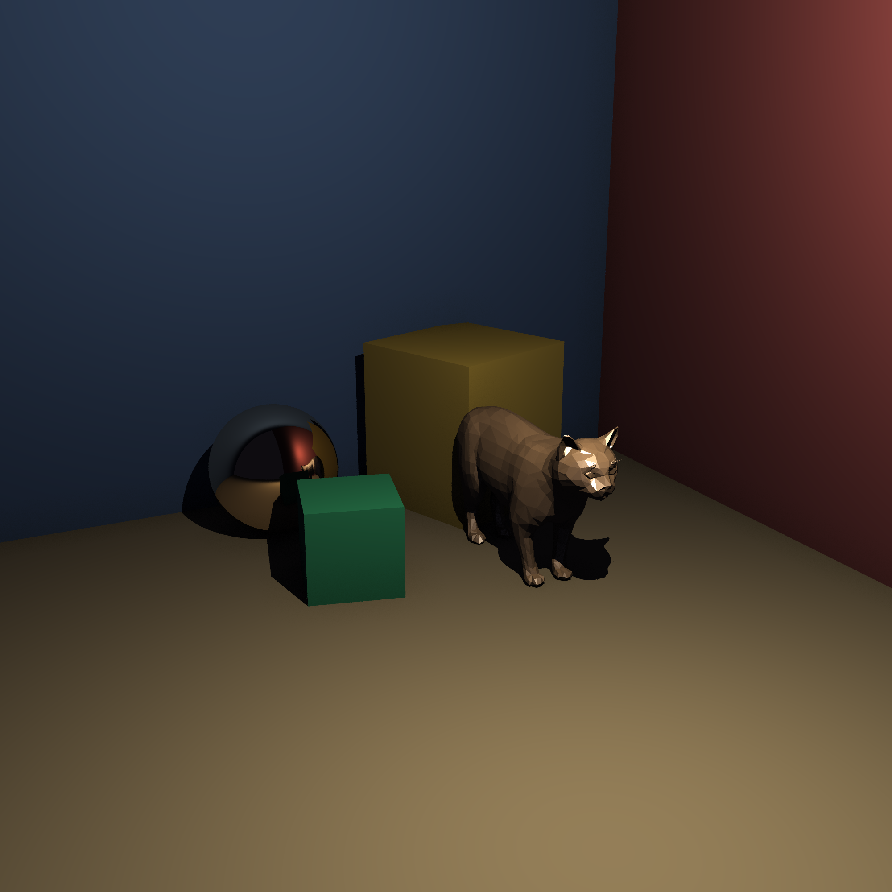
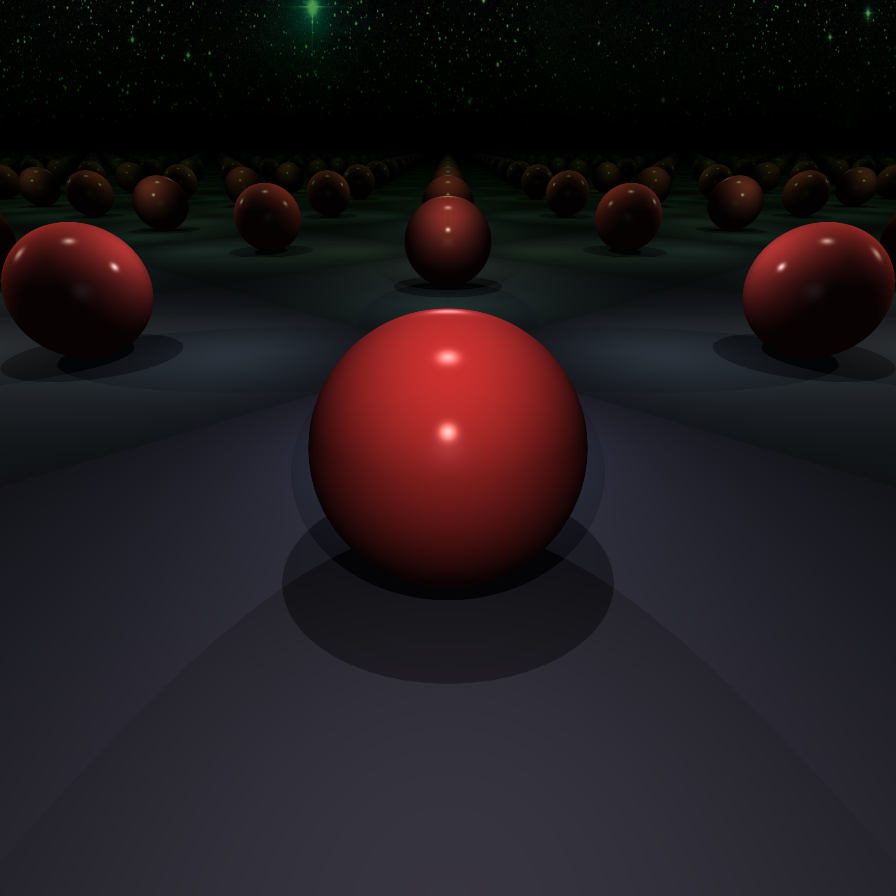
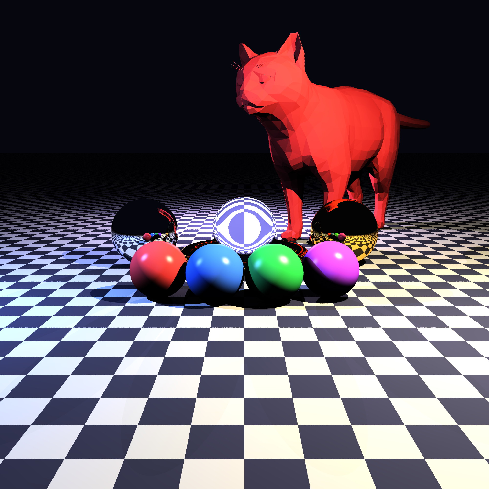
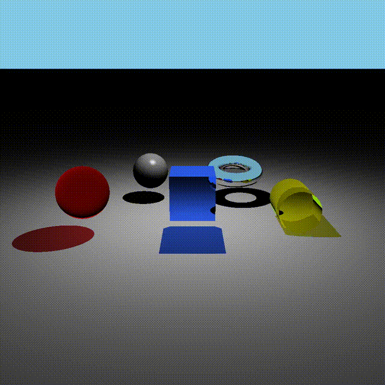

# Raytracer

A CPU raytracer written in C++20 with a plugin-based architecture. Supports physically-based materials, fractal shapes, scene composition, antialiasing, ambient occlusion, and live preview.

---


[](https://github.com/louisbgl/raytracer-mirror/graphs/contributors)

## Getting Started

### Clone

```bash
git clone git@github.com:louisbgl/raytracer-mirror.git raytracer
cd raytracer
```

### Build

**Linux (with live preview):**
```bash
cmake -B build -DCMAKE_BUILD_TYPE=Release -DWITH_UI=ON
cmake --build build -j
```

**macOS (SFML not supported, disable UI):**
```bash
cmake -B build -DCMAKE_BUILD_TYPE=Release -DWITH_UI=OFF
cmake --build build -j
```

This builds the `raytracer` binary and all plugins into `plugins/`.

### Render a scene

```bash
./raytracer scenes/example.txt
./raytracer scenes/example.txt --log    # with render stats
```

Output format is determined by the `output` field in your scene config (`.png`, `.jpg`, or `.ppm`). We use STB Image for loading/saving images, so any format it supports should work.

---

## Gallery

| | |
|---|---|
|  |  |
|  |  |



---

## Features

### Shapes

17 primitives and implicit surfaces, all loaded as plugins at runtime:

- Basic: Sphere, Box, Plane, Rectangle, Cylinder, Cone, Hourglass
- Limited variants: LimitedCylinder, LimitedCone, LimitedHourglass (capped with radius/height bounds)
- Complex: Torus, Tanglecube, Triangle, Mobius Strip
- Fractals: Julia Set 3D (distance-estimated), Menger Sponge
- Mesh: OBJ file loading via Triangle soup

### Materials

- **Lambertian** - matte diffuse
- **Colored Diffuse** - per-face color control
- **Phong** - specular highlights with configurable shininess
- **Reflective** - mirror reflections with reflectivity factor
- **Refractive** - glass/water with opacity and refractive index
- **Chessboard** - procedural checkerboard pattern
- **Perlin Noise** - procedural noise texture
- **Image Texture** - PNG, JPG, or PPM mapped onto shapes
- **Normal Mapped** - bump detail via normal map images

### Lighting

- Point lights (position, color, intensity)
- Directional lights (direction, color, intensity)
- Colored shadows

### Rendering

- **Antialiasing:** SSAA (jittered grid) and Adaptive SSAA (variance-driven subdivision)
- **Ambient Occlusion:** hemisphere sampling, configurable samples and radius
- **Tone Mapping:** ACES filmic curve with adjustable strength
- **Background:** solid color or HDR/image backdrop
- **Multithreading:** configurable thread count
- **AABB culling:** automatic bounding box acceleration for all bounded shapes
- **Recursive scattering:** reflections and refractions with configurable depth

### Scene System

Scenes are text configs (libconfig++ format). Materials are defined once and referenced by name. Scenes can embed other scene files with their own position, rotation, and scale — recursively, with cycle detection.

```rust
camera:
{
    resolution = { width = 1920; height = 1080; };
    position = { x = 0.0; y = 0.0; z = 5.0; };
    look_at = { x = 0.0; y = 0.0; z = 0.0; };
    up = { x = 0.0; y = 1.0; z = 0.0; };
    fieldOfView = 90.0;
};

renderer:
{
    antialiasing = {
        enabled = true;
        method = "adaptive";
        threshold = 0.1;
    };
    lighting = {
        ambientColor = { r = 200; g = 200; b = 200; };
        ambientMultiplier = 0.3;
        diffuseMultiplier = 0.8;
        ambientOcclusion = {
            enabled = true;
            samples = 16;
            radius = 4.0;
        };
    };
    toneMapping = {
        enabled = true;
        strength = 0.8;
    };
    background = { color = { r = 20; g = 20; b = 30; }; };
    output = "output.png";
};

materials:
{
    lambertian = (
        { name = "ground"; color = { r = 180; g = 180; b = 180; }; }
    );

    reflective = (
        { name = "mirror"; reflectivity = 0.95; color = { r = 255; g = 255; b = 255; }; }
    );
};

shapes:
{
    spheres = (
        { position = { x = 0.0; y = 0.0; z = 0.0; }; radius = 1.0; material = "mirror"; }
    );
    planes = (
        { position = { x = 0.0; y = -1.0; z = 0.0; }; normal = { x = 0.0; y = 1.0; z = 0.0; }; material = "ground"; }
    );
};

lights:
{
    point = (
        { position = { x = 5.0; y = 10.0; z = -5.0; }; color = { r = 255; g = 255; b = 255; }; intensity = 1000.0; }
    );
};

// embed another scene file with transform applied
scenes = (
    { path = "scenes/other.txt"; position = { x = 5.0; y = 0.0; z = 0.0; }; rotation = { x = 0.0; y = 45.0; z = 0.0; }; }
);
```

### Live Preview

With `-DWITH_UI=ON` (Linux), an SFML window shows the render as it progresses in real time.

### Plugin System

Every shape, material, and light is a dynamically loaded `.so`. Adding a new primitive means implementing one interface and dropping it in `plugins/`. No recompilation of core required.

---

## Scene Config Reference

Full parameter list available via:

```bash
./raytracer --help
```

Find all scene config options using:

```bash
./raytracer --usage
```
